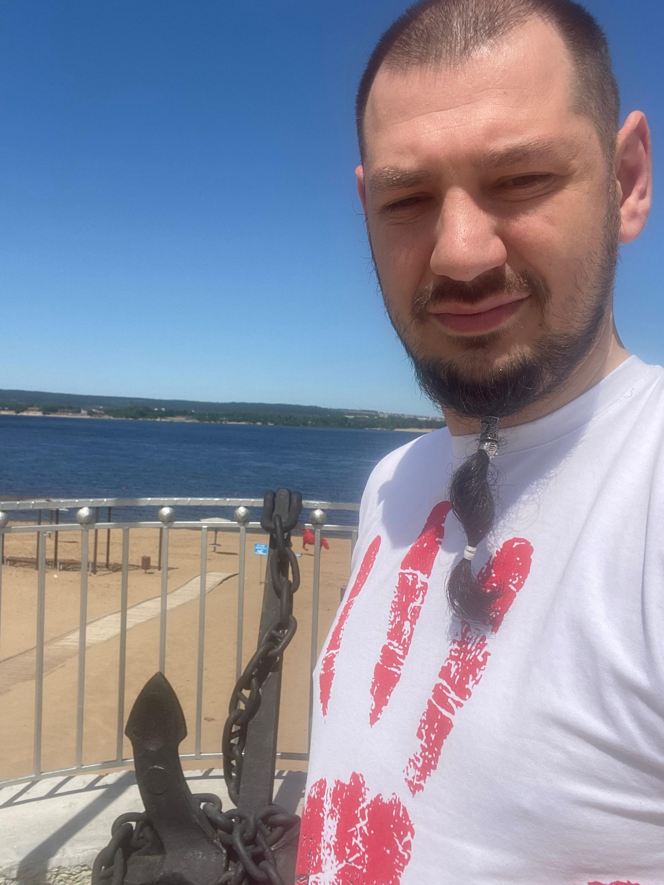

theme: cayman

_**Клоков 
Алексей 
Александрович**_

Мужчина, 37 лет, 

тел. +7 (903) 300----

Slim_63rus@mail.ru — предпочитаемый способ связи

Проживает: Сызрань

Гражданство: Россия

Место работы. Ледовый дворец спорта "Сызрань-Арена"

#### Должность 
инженер по эксплуатации здания и оборудование 

Занятость: полная занятость
График работы: полный день

### Образование

2025 ООО «Нетология» российская компания и образовательная онлайн-платформа, запущенная в 2011 году. Входит в IT-холдинг TalentTech
Направление - Инженер по тестированию: расширенный курс
Высшее "Бакалавриат"

2022	Самарский Государственный Технический Университет филиал в г. Сызрань
Электроснабжение промышленных предприятий, Инженер электрик

2012	НОУ ВШПП «Самарский институт Высшая школа приватизации и предпринимательства»
Компьютерные и информационные технологии в рекламе, Специалист по рекламе.

2008	Губернский колледж
АТПиП, Слесарь КИПиА 5 р.электромонтер 2 р.
